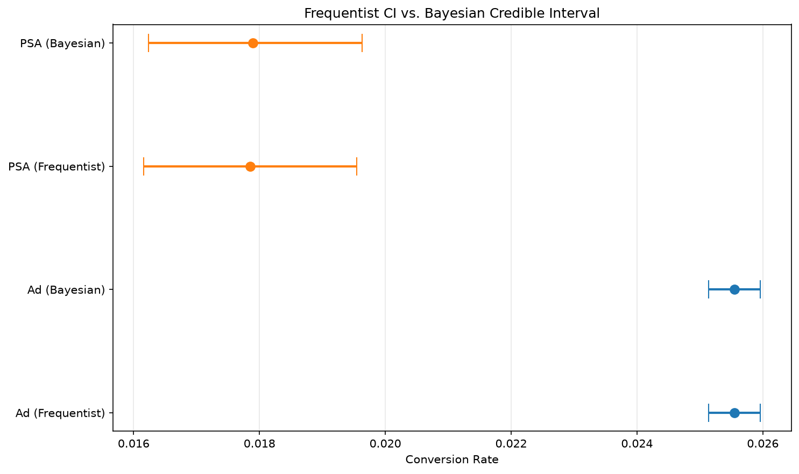

# Bayesian vs. Frequentist A/B Testing

A comparison of frequentist and Bayesian approaches to A/B test analysis, using a real-world marketing dataset. Includes a simulation of sequential monitoring ("peeking") to show where the two methods practically diverge.

## Motivation

As a workforce management forecast analyst, I regularly rely on statistical comparisons to evaluate whether operational changes are actually working. This project was a chance to go deeper into the two major statistical frameworks used for that kind of decision-making — frequentist and Bayesian — and understand not just how to run each test, but when and why they lead to different conclusions.

## Dataset

[Marketing A/B Testing](https://www.kaggle.com/datasets/faviovaz/marketing-ab-testing) (Kaggle) — 588,101 users split into two groups:
- `ad`: shown a marketing advertisement (564,577 users)
- `psa`: shown a public service announcement instead, acting as the control group (23,524 users)

Outcome variable: whether the user converted (`converted`: True/False).

## Methods

1. **Exploratory Data Analysis** — group sizes, conversion rates, and distribution checks.
2. **Frequentist analysis** — two-proportion z-test, confidence intervals, effect size.
3. **Bayesian analysis** — Beta-Binomial conjugate model, posterior distributions, credible intervals, prior sensitivity check.
4. **Sequential peeking simulation** — comparing how the frequentist p-value and Bayesian posterior probability behave as sample size grows, simulating an analyst checking results repeatedly rather than at one pre-planned point.

## Key Findings

- **Ad group conversion rate: 2.55%** (95% CI: 2.51%–2.60%) vs. **PSA group: 1.79%** (95% CI: 1.62%–1.95%)
- Two-proportion z-test: z = 7.37, **p < 0.0001**
- Bayesian posterior: **P(ad conversion rate > psa conversion rate) = 1.0000**
- With a flat prior and this much data, frequentist and Bayesian intervals converge almost exactly — the choice of framework doesn't change the practical conclusion at full sample size.
- **The real difference shows up under sequential monitoring**: the frequentist p-value fluctuated substantially at small sample sizes (crossing above and below the 0.05 threshold multiple times) before stabilizing, while the Bayesian posterior probability stabilized earlier and more smoothly.

*(placeholder — see notebook for full chart)*

## What This Means in Practice

Frequentist and Bayesian methods largely agree when analyzing a large, complete dataset once. They diverge in usefulness when an experiment is being monitored continuously — a common real-world scenario — since frequentist p-values aren't formally valid under repeated peeking without correction, while Bayesian posteriors remain interpretable at any point in data collection.

## Tools

Python, pandas, numpy, scipy, matplotlib, statsmodels

## Repo Structure
├── data/ # raw dataset (see link above to download)
├── notebooks/ # analysis notebook(s)
├── src/ # reusable functions (if/when refactored)
├── requirements.txt

## Next Steps

- Bayesian logistic regression incorporating covariates (ad frequency, day/hour)
- Formal frequentist sequential testing correction (e.g., alpha-spending) for a more rigorous peeking comparison