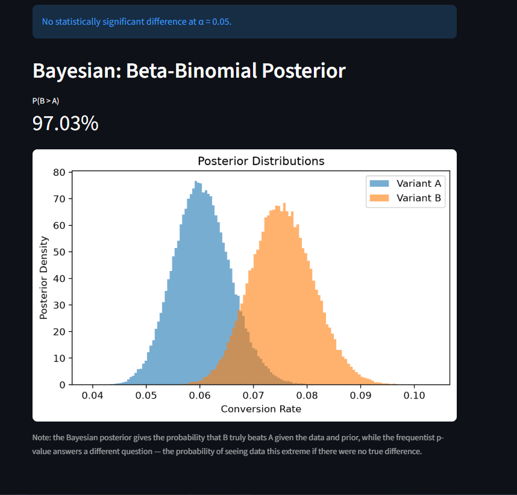
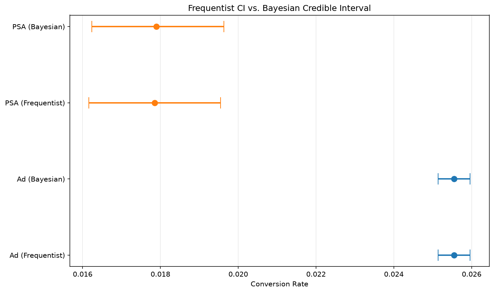
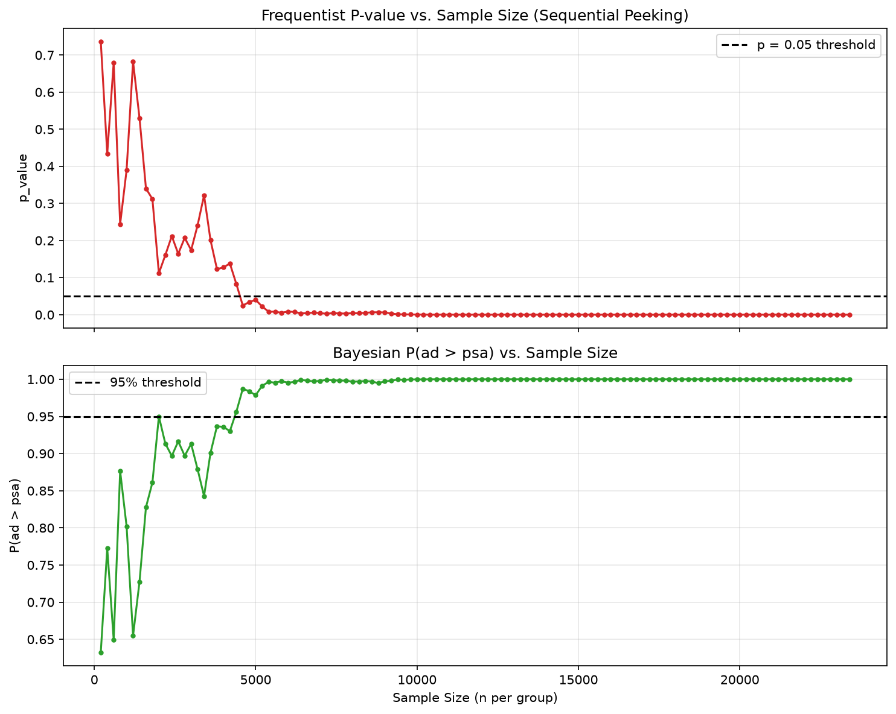

# Bayesian vs. Frequentist A/B Testing

A comparison of frequentist and Bayesian approaches to A/B test analysis, using a real-world marketing dataset, including a live, interactive calculator and a simulation of sequential monitoring ("peeking") to show where the two methods practically diverge.

**[Try the live app →](https://bayesian-ab-testing-yprjf8jfxdczvqrdzxul7n.streamlit.app)**

## Motivation

Statistical framework choice isn't just academic. Frequentist and Bayesian methods can lead to different practical conclusions, especially with small samples or continuous monitoring, both common realities in production experimentation. This project was a chance to move past "run a t-test and check p < 0.05" and actually understand *when* and *why* each framework's assumptions hold up (or don't).

I work in workforce forecasting, where similar tradeoffs (small samples, decisions made before "enough" data has accumulated) come up constantly. That context is part of what drew me to this comparison, but the goal here was to build a rigorous, general-purpose analysis, not a workforce-specific tool.

## 🚀 Live Demo

Try the interactive calculator: **[Bayesian vs. Frequentist A/B Test Calculator](https://bayesian-ab-testing-yprjf8jfxdczvqrdzxul7n.streamlit.app)**

Enter conversion data for two variants and instantly compare a frequentist 
two-proportion z-test against a Bayesian Beta-Binomial posterior analysis, 
including a live visualization of both posterior distributions.


*A scheduled GitHub Actions workflow pings the app every 6 hours to prevent it from spinning down due to inactivity (a normal behavior for free-tier Streamlit hosting).*

## Dataset

[Marketing A/B Testing](https://www.kaggle.com/datasets/faviovaz/marketing-ab-testing) (Kaggle) — 588,101 users split into two groups:
- `ad`: shown a marketing advertisement (564,577 users)
- `psa`: shown a public service announcement instead, acting as the control group (23,524 users)

Outcome variable: whether the user converted (`converted`: True/False).

## Methods

1. **Exploratory Data Analysis** — group sizes, conversion rates, and distribution checks.
2. **Frequentist analysis** — two-proportion z-test, confidence intervals, effect size.
3. **Bayesian analysis** — Beta-Binomial conjugate model, posterior distributions, credible intervals, prior sensitivity check.
4. **Sequential peeking simulation** — comparing how the frequentist p-value and Bayesian posterior probability behave as sample size grows, simulating an analyst checking results repeatedly rather than at one pre-planned point.

## Key Findings

- **Ad group conversion rate: 2.55%** (95% CI: 2.51%–2.60%) vs. **PSA group: 1.79%** (95% CI: 1.62%–1.95%)
- Two-proportion z-test: z = 7.37, **p < 0.0001**
- Bayesian posterior: **P(ad conversion rate > psa conversion rate) = 1.0000**
- With a flat prior and this much data, frequentist and Bayesian intervals converge almost exactly:



- **The real difference shows up under sequential monitoring**: the frequentist p-value fluctuated substantially at small sample sizes, repeatedly crossing the 0.05 threshold before stabilizing, a known risk of "peeking" at frequentist results before a planned sample size is reached. The Bayesian posterior probability was similarly noisy early on, but remains statistically valid to interpret at any point in data collection, without the same formal penalty for checking results early or often.



## What This Means in Practice

With a large, complete sample analyzed once, frequentist and Bayesian methods converge and the choice of framework doesn't change the practical conclusion. The divergence shows up under continuous monitoring: frequentist p-values aren't formally valid under repeated testing without correction (e.g., alpha-spending), while Bayesian posteriors remain interpretable at any point in data collection. In practice, this makes Bayesian methods a more natural fit for dashboards and experiments that get checked in real time, rather than analyzed once at a predetermined endpoint.

## Tools

Python, pandas, numpy, scipy, matplotlib, statsmodels, streamlit

## Repo Structure

```
├── data/           # raw dataset (see link above to download)
├── notebooks/      # analysis notebook(s)
├── src/            # reusable functions (frequentist.py, bayesian.py, simulation.py)
├── app.py          # live Streamlit demo
├── requirements.txt
```

## Next Steps

- Bayesian logistic regression incorporating covariates (ad frequency, day/hour)
- Formal frequentist sequential testing correction (e.g., alpha-spending) for a more rigorous peeking comparison
